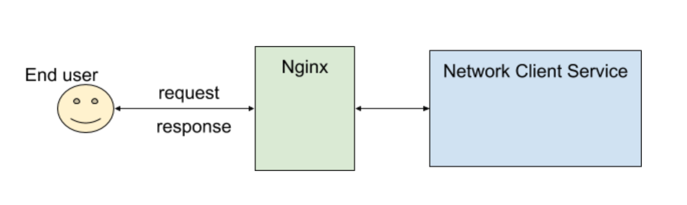
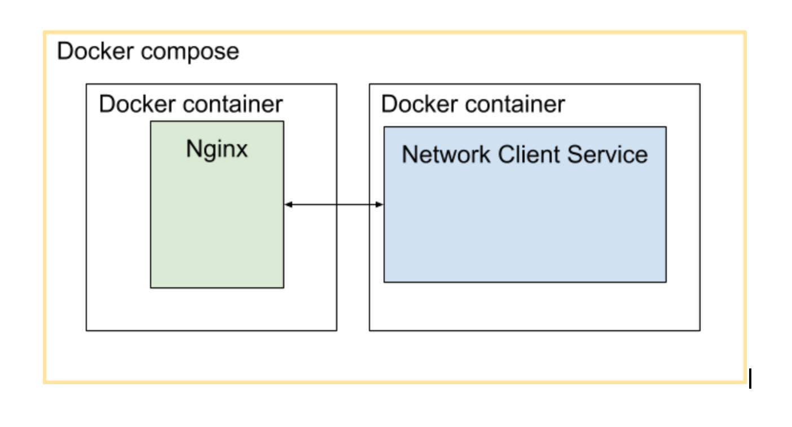

- [Introduction](#introduction)

- [Network Client Service Design](#network-client-service-design)
   * [Technology Stack](#technology-stack)

- [Setup Local Development Environment](#setup-local-development-environment)

- [Starting the Application](#starting-the-application)

- [Stopping the Application](#stopping-the-application)

- [Network Client Service REST Endpoints](#network-client-service-rest-endpoints)
   * [Multiply 2 Numbers](#multiply-2-numbers)
   * [Divide 2 Numbers](#divide-2-numbers)
   * [Add 2 Numbers](#add-2-numbers)


## Introduction

This a REST service which exposes end-points that accepts requests with json format and reply in json format.

The REST service is handling simple operations like multiply , add and divide two numbers.
  
The application is be able to handle multiple concurrent requests.

## Network Client Service Design

This is a server application that accepts requests over http to `Nginx` and sends those requests to a `Java` server application base on `Spring Boot`.


and to make it easy i used docker as the following
 
 

#### Technology Stack
  * `Java`
  * `Spring Boot`
  * `Git`
  * `Maven`
  * `Nginx`
  * `Docker`
  * `Shell Script`
   
## Setup Local Development Environment   
To setup the project locally you need to have `Java` version `1.8`  , `Maven` version `3.5.3` , `Git` version `2.17.0` and `Docker` version `19.03.5` installed on your machine no problem if you have version above the mention versions but not older.
 * Clone the repo 
  ```
    git clone https://github.com/AhmedNashatAli/network-client-service.git
   ```
 * Go to the directory 
  ```
    cd network-client-service
   ```  
 * Package the application  
  ```
    mvn clean package
   ```    
 * To run the application without docker and to play with swagger  
  ```
    java -jar target/network-client-service-0.0.1-SNAPSHOT.jar
   ```  
Once app is running, you can see the swagger API here [http://localhost:8080/api/v1/calc/swagger-ui.html#/calculation-controller](http://localhost:8080/api/v1/calc/swagger-ui.html#/calculation-controller)  
note that the application will run as single server because we did not start the nginx

## Starting the Application
This script will start to build the application and the docker images and it will run the docker compose.
please run chmod command on the shell file to be able to execute it.
```
 chmod +x run.sh
``` 
then
```
 ./run.sh   
``` 

## Stopping the Application
This script will stop the application
please run chmod command on the shell file to be able to execute it.
```
 chmod +x run.sh
``` 
then
```
 ./stopping.sh   
``` 

  
## Network Client Service REST Endpoints

To be able to test the following endpoints you need to [Starting the Application](#starting-the-application) correctly.

 #### Multiply 2 Numbers

 To request multiply endpoint `/api/v1/calc/multiply` you should post json contains firstNumber and  secondNumber like the following
  ```
  curl -X POST "http://localhost/api/v1/calc/multiply" -H "accept: */*" -H "Content-Type: application/json" -d "{ \"firstNumber\": 10, \"secondNumber\": 200}" 
  ``` 
  Response body
  
   ```json
 {
   "input": {
     "firstNumber": 10,
     "secondNumber": 200
   },
   "result": 2000
 }
   ```
 
 #### Divide 2 Numbers

 To request divide endpoint `/api/v1/calc/divide` you should post json contains firstNumber and  secondNumber like the following
  ```
  curl -X POST "http://localhost/api/v1/calc/divide" -H "accept: */*" -H "Content-Type: application/json" -d "{ \"firstNumber\": 10, \"secondNumber\": 2}" 
  ``` 
  Response body
  
   ```json
 {
   "input": {
     "firstNumber": 10,
     "secondNumber": 2
   },
   "result": 5
 }
   ```
 
 #### Add 2 Numbers
  To request add endpoint `/api/v1/calc/add` you should post json contains firstNumber and  secondNumber like the following
 ```
 curl -X POST "http://localhost/api/v1/calc/add" -H "accept: */*" -H "Content-Type: application/json" -d "{ \"firstNumber\": 19, \"secondNumber\": 20}" 
 ``` 
 Response body
 
  ```json
{
  "input": {
    "firstNumber": 19,
    "secondNumber": 20
  },
  "result": 39
}
  ```